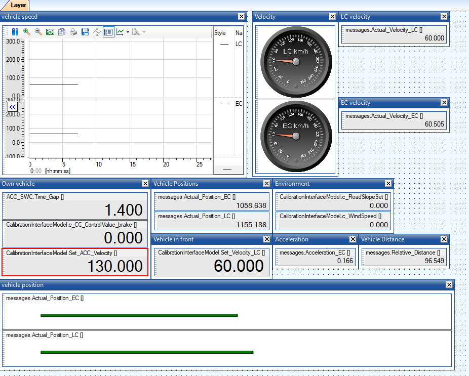

# Adaptive Cruise Control

The projects in this folder demonstrate the following:

* A control model for adaptive cruise control.
* Vehicle model
* PC simulation of the control model with a vehicle model in closed loop
* Unit Test with vehicle model in the loop
* AUTOSAR code generation.
* EHANDBOOK generation

