# BalanceBot
The BalanceBot example shows an ASCET-DEVELOPER model used to create two PI controllers for balancing and moving a Self-Balancing Robot Car Kit. It uses the PlatformIO plugin to compile and upload the generated C Code to the Arduino which is contained in the robot kit. There is also a small Windows application (SendCommandOverSerial.exe) which uses a serial COM port to communicate with the bot. The COM port is actually attached to a bluetooth adapter via SPP (Serial Port Profile). The app is used as a remote control. The application can be built from the C# project SendCommandOverSerial2.sln with the [Visual Studio Community Edition](https://visualstudio.microsoft.com/de/vs/community/).

## Getting Started
A Self-Balancing Robot Car Kit can be found [here](https://www.adeept.com/adeept-2-wheel-self-balancing-upright-car-robot-kit-for-arduino-uno-r3-mpu6050-accelerometer-gyroscope-sensor-tb6612-motor-driver_p0094_s0023.html). It differs a little bit from the one we used (see photos), but it seems to be newer and ours is no longer available.
* ⬇️ Download and install the [ASCET Community Edition](https://www.etas.com/en/products/ascet-developer-contact-form.php).
* 🎓 Master your ASCET skills by doing the tutorial series within the tool.
* 📁 Import the BalanceBot Example.
* 💻 Run the PC simulation.
* 📣 Engage in our [discussions forum](https://github.com/etas/ascet/discussions) and share your thoughts on the bot.
 

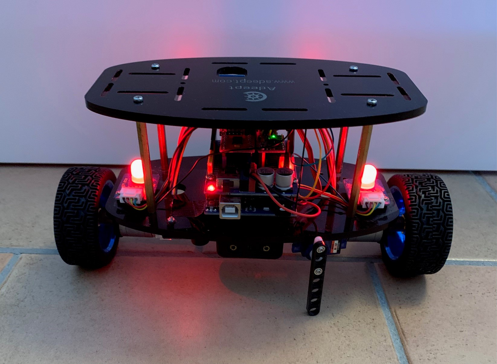
We added a little servo to park the Bot during upload of code via bluetooth. It needs 5V power from the board and is connected to the PWM pin 11.

## PC Simulation
In the PC Simulation you will see how the ObstacleAvoidance sub state machine reacts on different distance sensor inputs.
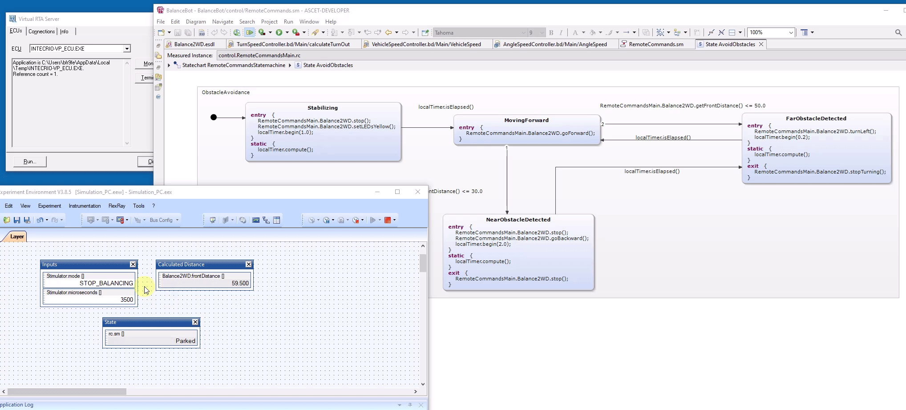
## ASCET Model Overview
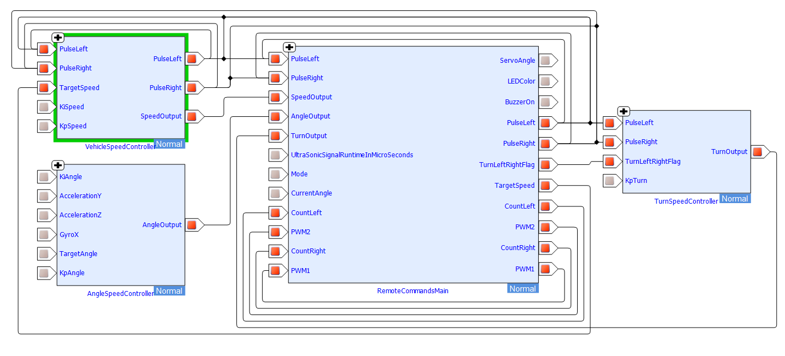
We use three controllers to control the physical movement of the bot:
* AngleSpeedController
* VehicleSpeedController 
* TurnSpeedController

In the end the output to the engines is the sum of AngleOutput + SpeedOutput + TurnOutput.

The RemoteCommands state machine is used to control the three modes of the bot:
* ObstacleAvoidance
* ManualDrive
* OpenLab
### Angle Speed Controller
The Angle Speed Controller uses the current angle derived from the onboard IMU and compares it to the target angle of the bot. It then calculates the engine output needed to get to the target angle.

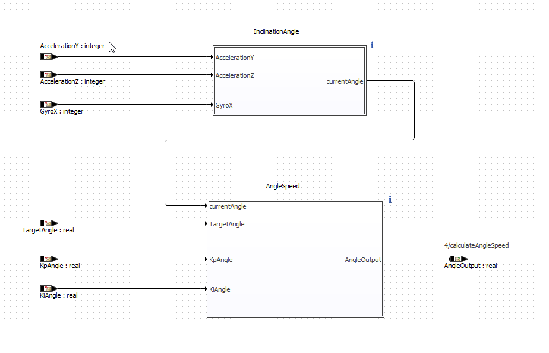
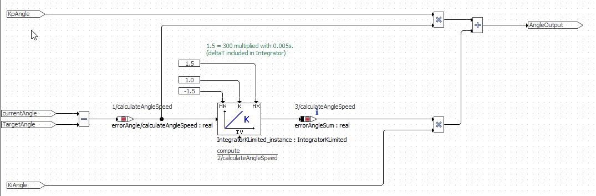
### Vehicle Speed Controller
The Vehicle Speed Controller uses the current speed and compares it to the target speed. It then calculates the additional engine output needed to get to the target speed.

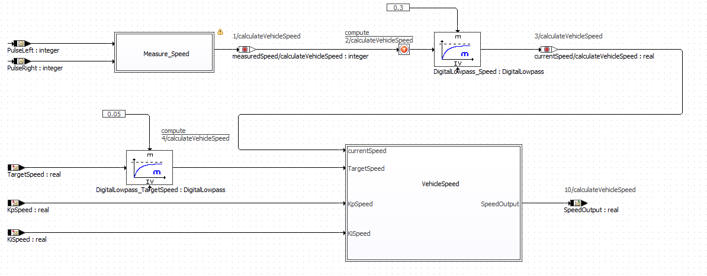
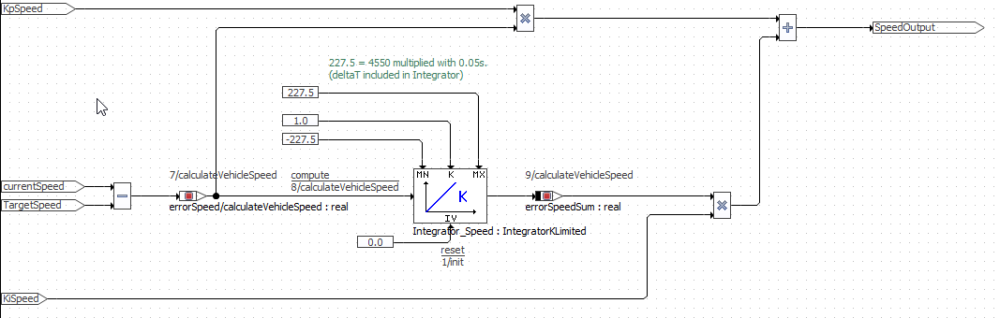
### Turn Speed Controller
The Turn Speed Controller adds/substracts engine output to turn the bot to the left or right.

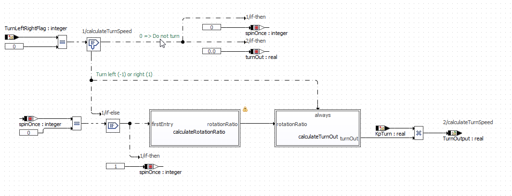
### RemoteCommands State Machine
The state machine contains three sub state machines:
* AvoidObstacles tries to avoid moving into objects in front of the bot. The objects are detected by the mounted ultrasonic sensor. 
* ManualDrive is used to remote control the bot. It uses single character commands sent via the bluetooth SPP connection using the SendCommandOverSerial.exe.
* OpenLab is a template to start with your own exploration. 

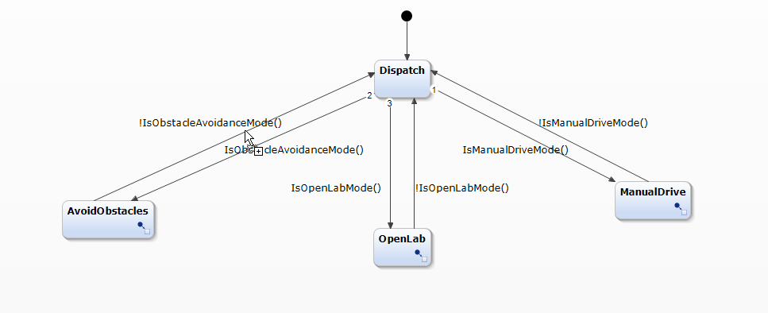
### ObstacleAvoidance in the RemoteCommands State Machine
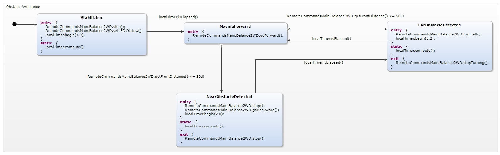
### ManualDrive in the RemoteCommands State Machine
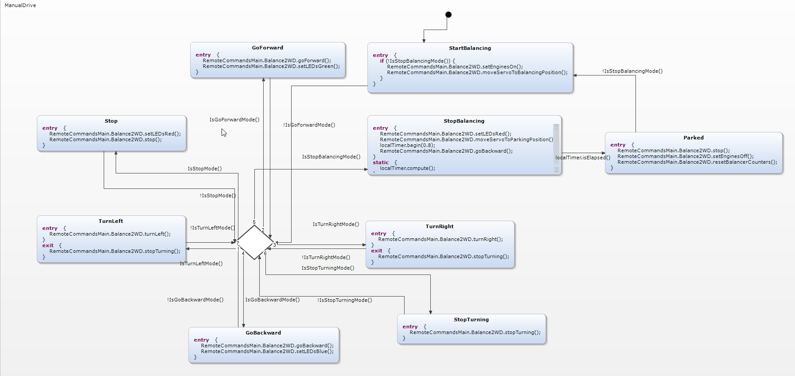
## Arduino and PlatformIO Integration
To prepare ASCET-DEVELOPER for Arduino and PlatformIIO read the ASCET-DEVELOPER User Guide in Help->Help Contents

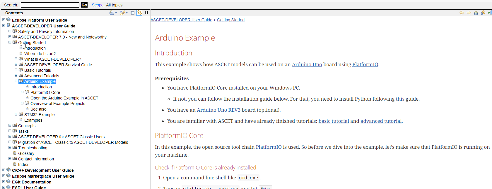

Upload your code to the bot and have fun!