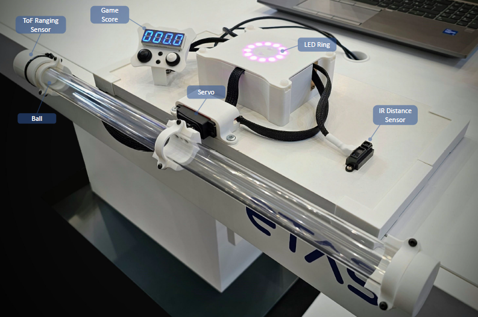
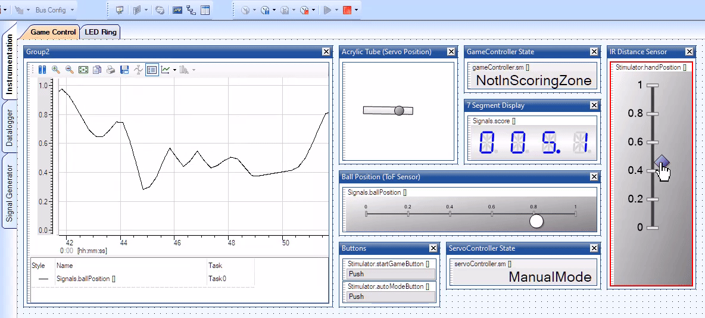
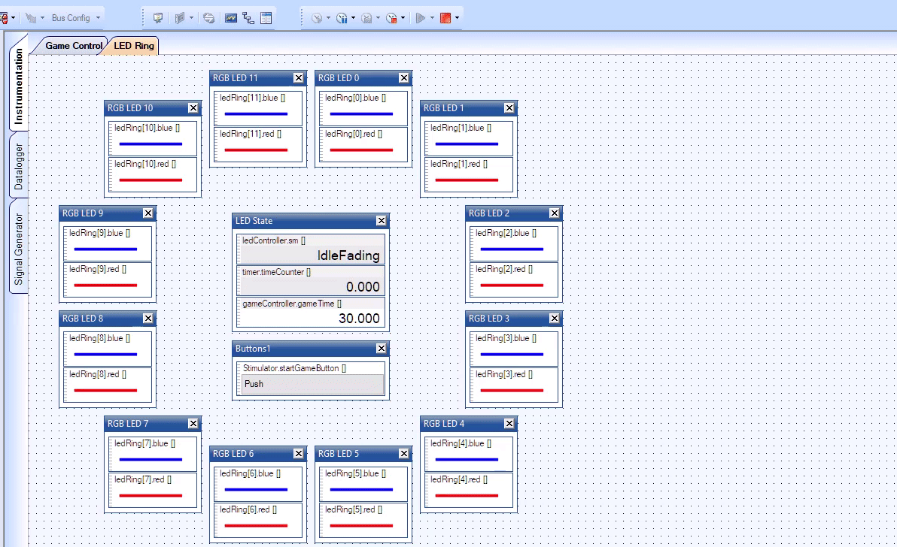
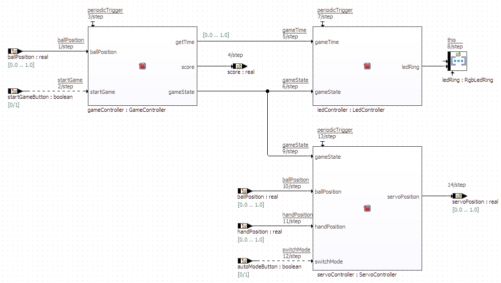
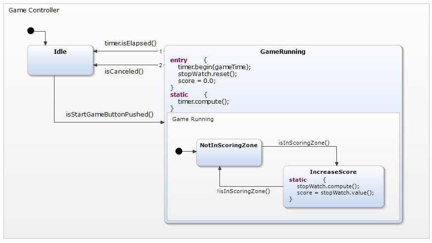
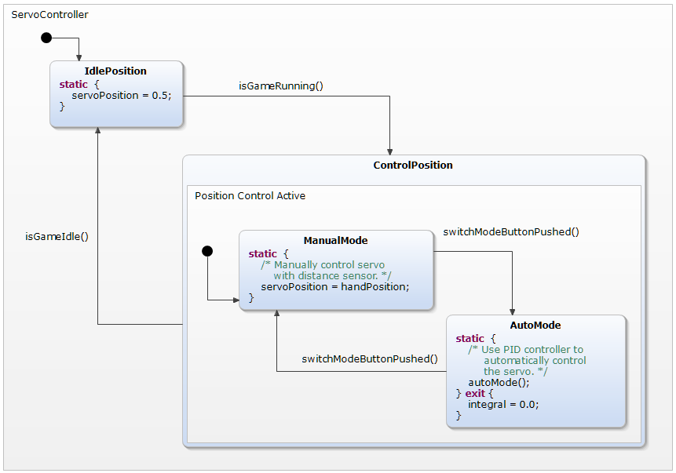
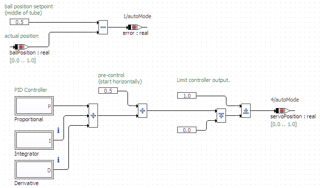
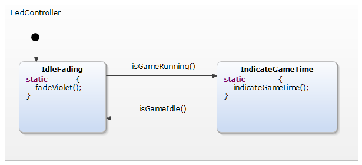
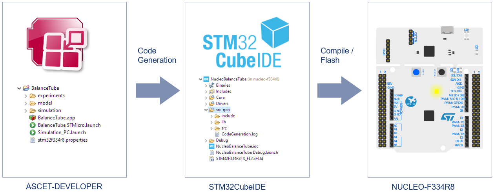

# BalanceTube (Embedded World 2024) 

BalanceTube is a game we have developed to demonstrate in a playful manner how [ASCET-DEVELOPER](https://www.etas.com/en/products/ascet-developer.php) eases embedded software development.
The main component of the game is an acrylic tube which is connected to a servo motor.
The servo can be remotely controlled with your hand by using the infrared distance sensor.
Within the  tube there is a ball.
By controlling the servo you can tilt the tube by which the ball moves left and right.
The goal of the game is to keep the ball in the middle of the tube for as long as possible.

## Getting Started

* ⬇️ Download and install the [ASCET Community Edition](https://www.etas.com/en/products/ascet-developer-contact-form.php).
* 🎓 Master your ASCET skills by doing the tutorial series within the tool.
* 📁 Import the BalanceTube Example.
* 💻 Run the PC simulation.
* 📣 Engage in our [discussions forum](https://github.com/etas/ascet/discussions) and share your thoughts on the game.

## PC Simulation

The BalanceTube example comes with a fully prepared simulation setup. So don't worry if you do not have your hardware in place.
Simply import the BalanceTube example into ASCET-DEVELOPER and run the prepared PC Experiment launch file. The experiment comes with two views.

* In the first view you can play the game by stimulating the buttons and the infrared distance sensor.
You can see the resulting servo and ball positions and your score.
* In the second view you can see how the RGB LED ring behaves depending on the game state and remaining game time.

## ASCET Model Overview

### MainClass

Let's have look on how the game was programmed using ASCET.
The entry point of our model is `MainClass` and it is implemented using the ASCET Block Diagram Editor.
Here, you can see all the inputs of the game:

* `ballPosition`: The current position of the ball within the acrylic tube measured by the [ToF ranging sensor](https://www.st.com/en/imaging-and-photonics-solutions/vl53l0x.html). The input is normalized to a range of zero to one before entering our model.

* `handPosition`: The hand position measured by the [infrared distance sensor](https://global.sharp/products/device/lineup/data/pdf/datasheet/gp2y0a21yk_e.pdf). The input is normalized to a range of zero to one before entering our model.
  
* `startGameButton`: This boolean variable reflects the current state of the black push button.

* `autoModeButton`: This boolean variable reflects the current state of the white push button.

These inputs are used to calculate the outputs of our model:

* `score`: The time in seconds that the ball is in the middle of the tube. This value is displayed on the [7-segment display](https://www.adafruit.com/product/881).

* `servoPosition`: The calculated position of the servo for tilting the acrylic tube. The output is normalized to a range of zero to one before leaving our model.

* `ledRing`: An array of RGB values of an [LED ring](https://www.adafruit.com/product/1463) to indicate the remaining time of the game.

To calculate the model outputs, some helper classes are being used.

### GameController Class

The `GameController` class is mainly implemented using the ASCET Statemachine Editor.
It evaluates the `startGameButton` variable to switch from `Idle` to `GameRunning` state.
While the game is running, the condition `isInScoringZone()` is used to transition between states `IncreaseScore` and `NotInScoringZone`. The implementation of that method can be found in [GameController.esdl](ASCET-DEVELOPER/BalanceTube/model/GameController.esdl).

### ServoController Class

The `ServoController` class is partly implemented using the ASCET Statemachine Editor.
In `IdlePosition` the servo holds its middle position to keep the tube horizontally.
When the game is running, the servo can be controlled in `ManualMode` using the IR distance sensor measuring your hand position.
Alternatively, there is an `AutoMode` to show how the ball position can be controlled automatically.

The automatic mode of `ServoController` is implemented using the ASCET Block Diagram Editor.
Here, we use a PID controller to control the `servoPosition` such that the `ballPosition` approaches the middle of the tube. Again, we work with zero-to-one normalized variables.

### LedController Class

Finally, there is the `LedController` to control the 12 RGB LEDs of the LED ring.
There are two states, namely `IdleFading` where the LED ring is simply fading on and off and `IndicateGameTime`.
In this state, the LED ring is acting as a game clock and displaying the time left to play.
The actual model behavior of the different states is implemented textually in [LedController.esdl](ASCET-DEVELOPER/BalanceTube/model/LedController.esdl).

## STM32CubeIDE Integration

ASCET can be used to generate device independent ANSI C code from your model.
This code can then be compiled and flashed into any embedded device.
In this example, we use the [NUCLEO-F334R8](https://www.st.com/en/evaluation-tools/nucleo-f334r8.html) evaluation board carrying the STM32F334R8 microcontroller.
To build and flash the code, we use the [STM32CubeIDE](https://www.st.com/en/development-tools/stm32cubeide.html).
Of course, with ASCET, you can use any other device or toolchain of your choice.

