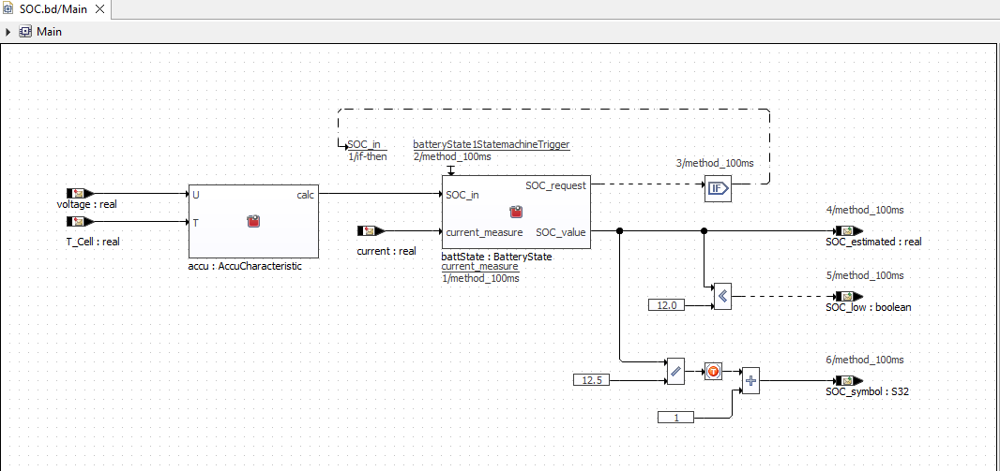
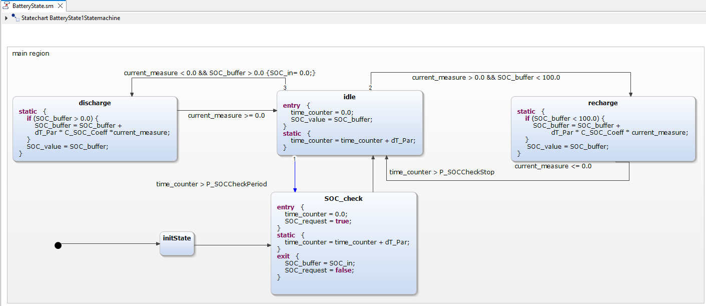
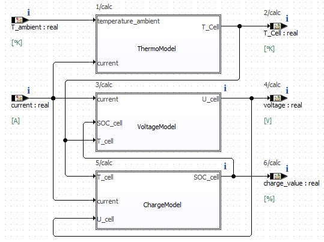
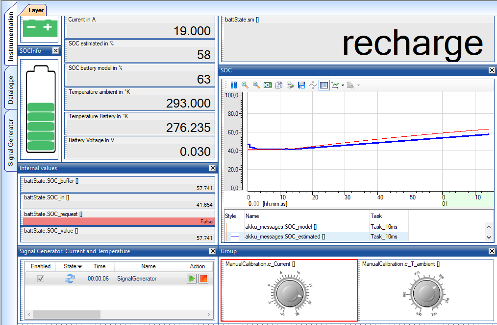

# Battery management

The projects in this folder demonstrate a battery management system.

## ASCET Model Overview

* `State of charge`

* `Battery control state machine`

* `Battery Plant Model` for temperature, voltage and charge

## PC Simulation

